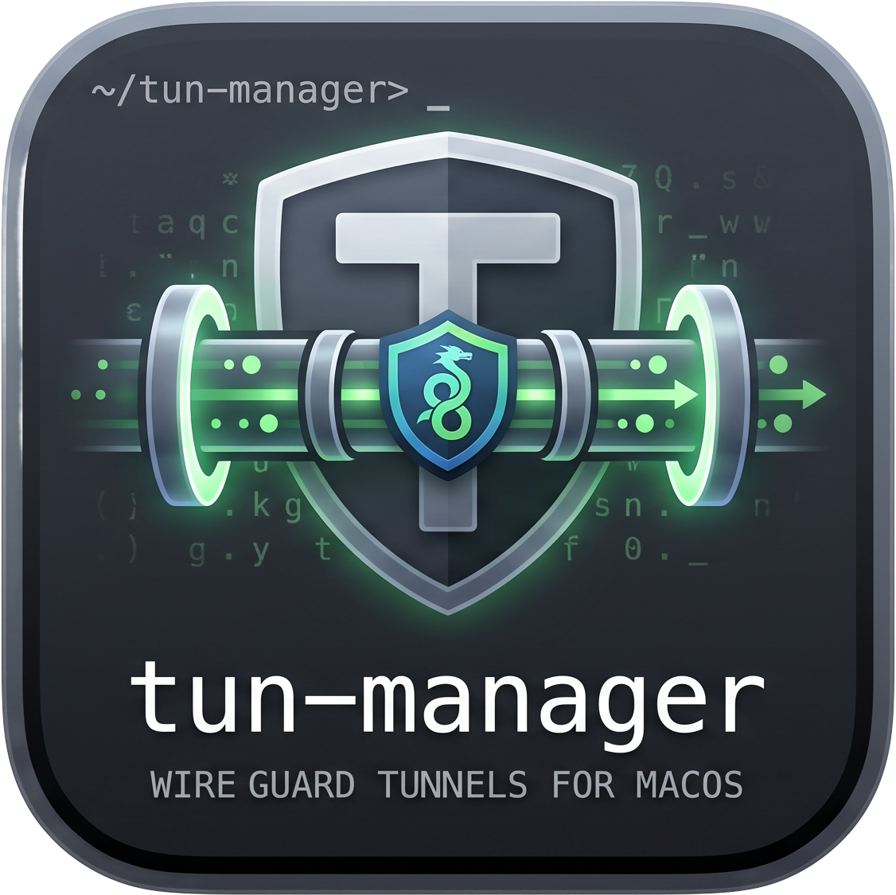
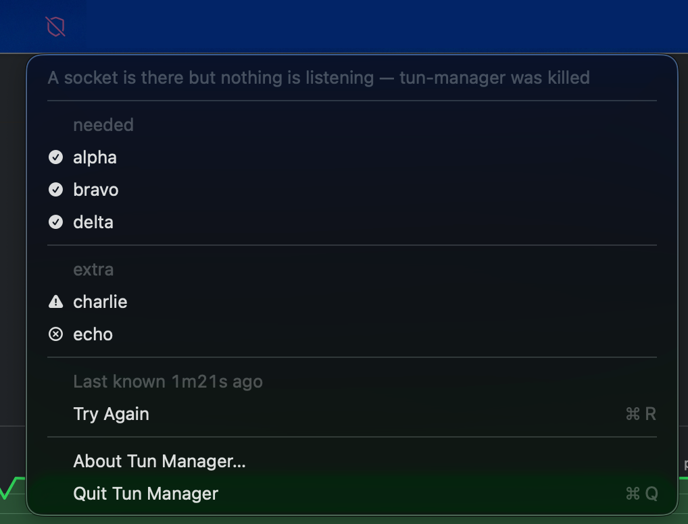

<div align="center">



# tun-manager

**Watch and drive the WireGuard tunnels of a macOS laptop, from one binary.**

Handshake age, transferred bytes, latency, and which network you are on.

[](https://github.com/nledez/tun-manager/actions/workflows/ci.yml)
[](https://coveralls.io/github/nledez/tun-manager?branch=main)
[](LICENSE)

</div>


The tunnels above are invented, served by the simulator described in [Seeing it
work, without tunnels](#seeing-it-work-without-tunnels) — so this is
reproducible on a machine with no WireGuard on it at all.

While a batch runs, a spinner turns beside the context, the header counts the
tunnels off, and the row being waited on says so where its state would be — so a
slow `wg-quick` is never mistaken for a hung program:

```
 tun-manager  ctx: office (en0 198.51.100.42)  ⠋ 2 running        next ⟳ 4m12s
 ───────────────────────────────────────────────────────────────────────────────
    NAME          GRP    STATE     HANDSHAKE  RX / TX        PING   ENDPOINT
 ▸  alpha         needed ● up      12s        1.2M / 840K    18ms   192.0.2.10:51820
    bravo         needed ● stale   9m04s      2.3M / 961K    ×      198.51.100.20:51821
    charlie       extra  ⠋ starting                                 gateway.example:51824
    delta         —      ⠋ stopping                                 198.51.100.30:51822
```

## Why

I run several WireGuard tunnels. Some have to be up whenever the laptop is,
others only when I ask. Nothing I found managed that distinction, so for a
while it was a shell script driving [gum](https://github.com/charmbracelet/gum)
— which works, and stops scaling the moment the tunnel list grows.

What it had to keep:

- tunnels stay managed by [wireguard-tools](https://www.wireguard.com/), not by a reimplementation
- configurations stay unreadable to anyone but root, so a key cannot leak
  through a file listing
- which tunnels are *needed* depends on the network the machine is on

## Why root

The program runs entirely as root, started with `sudo`. Two reasons:

- the WireGuard control sockets under `/var/run/wireguard` are root-only, and
  that is where the live state (handshakes, counters, endpoints) comes from;
- `wg-quick` creates the `utun` interface and rewrites the routing table.

`sudo` asks for the password before the binary starts, so the TUI never has to
prompt for one. Two consequences are handled explicitly:

- `sudo` rewrites `HOME` to `/var/root`, so the configuration file is resolved
  through `SUDO_USER` instead;
- root has no GUI session, so notifications are posted back as the pre-sudo user.

## Install

Download the archive for your machine from the
[releases](https://github.com/nledez/tun-manager/releases) — `darwin_universal`
runs on both Intel and Apple Silicon — or build from source:

```sh
brew install wireguard-tools
make build              # ./bin/tun-manager alone
make install            # /usr/local/bin/tun-manager
                        #   + /Applications/Tun Manager.app

# The root-only half of the configuration: the directories, the file that says
# what runs as root, and the key the menu bar application pins. It creates each
# one for root alone, tightens a directory that is already there and too open,
# and refuses to overwrite a configuration that exists -- that file holds the
# feed key, and replacing it is what makes the menu bar stop trusting you.
sudo tun-manager init-privileged

mkdir -p ~/.config/tun-manager
cp configs/config.example.yaml ~/.config/tun-manager/config.yaml

# Sudo is mandatory: it copies the file into /private/wireguard/config, which is
# owned by root and readable by nobody else. A "# TO_CHECK=" line is mandatory
# in each configuration file before it can be imported.
sudo tun-manager import <config1> ~/Downloads/config1.conf
...
# Edit ~/.config/tun-manager/config.yaml to fit the imported configurations.
# The example ships placeholder names: replace every one of them under groups
# and overrides, or up --group refuses a tunnel that does not exist.
# import only ever adds to the "all" group -- needed and extra are yours to fill.

# Check installation before first run
sudo tun-manager doctor

open "/Applications/Tun Manager.app"
# "tun-manager is not running" is normal, fix this with:
sudo tun-manager

# Press 's' to start needed tunnels, check if menubar application is sync with TUI
```

`make install` builds both halves, so it needs the Swift toolchain as well as
Go. `make build` and `make macos-app` do one each if you only want one.

**Run it as yourself, not with `sudo`.** The two destinations have different
owners — `/Applications` belongs to the admin group and needs no privileges,
while `/usr/local/bin` belongs to root — so the target asks for a password by
itself, for that one step. Running the whole thing as root would build as root
and leave a working tree full of files you can no longer write.

`PREFIX` and `APPDIR` both override.

## Usage

```sh
sudo tun-manager                    # interactive TUI
sudo tun-manager status             # aligned table
sudo tun-manager status --json      # for tmux, starship, scripts
sudo tun-manager up alpha bravo
sudo tun-manager up --group needed  # resolved against the current network
sudo tun-manager down --all
sudo tun-manager import work ~/Downloads/work.conf
sudo tun-manager backup             # tar.gz of the configuration and every .conf
tun-manager doctor                  # environment check; sudo to see the tunnels
```

### Keys

| Key | Action |
|---|---|
| `r` | refresh now |
| `p` | ping the check address of every live tunnel |
| `s` | tear everything down if anything is up, otherwise start the `needed` group |
| `␣` | select / deselect a tunnel |
| `⏎` | toggle the selection, or the row under the cursor |
| `n` | bring the `needed` group up |
| `g` | traffic graph of the tunnel under the cursor |
| `l` | log pane (command outcomes, errors) |
| `↑↓` `jk` | move · `?` help · `q` quit |

The table refreshes on its own every `refresh_interval` (5 minutes by default),
and right after every operation.

`g` opens a graph of the tunnel under the cursor, download above upload, each on
its own scale so that a busy download does not flatten the upload into a line
along the axis. Readings are taken once a second, but only while the pane is
open: closing it stops the sampling and drops the history.

A batch starts every tunnel at once, spaced a few milliseconds apart so that two
`wg-quick` runs do not reach the routing table in the same instant, so eight of
them take about as long as the slowest rather than as long as all of them added
up. Each reports for itself: the row says `starting` or `stopping` while it
waits, and the header counts how many are in flight.

Nothing waits for a batch. The cursor, the log pane and the help keep
responding, and `⏎` on another tunnel starts it there and then — batches
overlap. The one thing refused is a second `wg-quick` on a tunnel that already
has one, which is skipped rather than queued.

### Status feed

While `tun-manager` runs it publishes what it knows on a unix socket, so a
menu bar application can show tunnel state, graph traffic and raise
notifications without any privilege of its own.

In `/private/wireguard/config/tun-manager.yaml`, the half only root can write —
binding a socket and unlinking whatever was at its path are things root does, so
the path is not somebody else's to choose:

```yaml
feed: true                              # default
feed_socket: /var/run/tun-manager.sock  # default
```

Every connection is asked for by the kernel before it is answered: the feed
reads the peer's credentials with `LOCAL_PEERCRED` and serves root, the user the
socket was handed to, and nobody else. Credentials it cannot read are a refusal.
That is the check that stays true — a file mode is consulted at `connect(2)` and
never again, so everything below is what makes a foreign connection unlikely,
and this is what makes it useless.

It is `0600` from the moment it exists, not from the `chmod` that follows the
bind: the permissions of a unix socket are consulted at `connect(2)` and never
again, so anybody who connected during that window would go on reading the feed
for as long as `tun-manager` ran. The bind happens under a `umask` of `0177`,
and the `chmod` stays as the belt to that pair of braces.

It binds only under a directory root owns and nobody else can write, and it
unlinks only a socket: a stale one left by a killed `tun-manager` is taken back,
anything else — a file, a symbolic link, a directory — stops the feed with a
message rather than being deleted. `feed_socket` is read as root and unlinked as
root, so a typo in it was a way to have root remove somebody's file.

The socket is created by root and handed to whoever ran `sudo tun-manager`,
mode `0600`. It carries the same JSON as `tun-manager status --json`, one
object per line, plus a `hello` on connect, a `sample` once a second for each
tunnel a client asked to watch, a `ping` when a probe round finishes, and a
`bye` on the way out.

**The publisher proves which one it is.** Its hello carries the public half of
the key from `/private/wireguard/config/tun-manager.yaml`; a client may then
send thirty-two bytes of its own and get them back signed, together with the
schema, the version and the socket path. The nonce is the client's, so an
answer is good once and for it alone; the path is in there so that something
listening elsewhere cannot forward the question to the real publisher and pass
the answer off as its own. `tun-manager` refuses to publish at all without a
key: an application that pins one has to be able to tell "cannot prove itself"
from "has nothing to prove", and a fallback available to the honest case is a
fallback available to whoever is standing in for it.

What one client may cost is bounded: thirty-two connections at once — the
thirty-third is told why and closed — sixty-four watched tunnels each, eight
kilobytes to a line, and one signature a second. Each of those is counted per
client rather than for the publisher as a whole: a limit shared between clients
is one any client can spend on everybody else's behalf. There is no idle timeout, deliberately: the menu bar says
nothing at all until somebody opens it, so disconnecting a quiet client would
disconnect the healthy one.

**Nothing on that socket can start or stop a tunnel.** A client may watch a
tunnel's counters, ask for a refresh, and ask for a ping. That is the whole
vocabulary.

The ping is the one verb with an effect outside the process: honouring it makes
`tun-manager`, which runs as root, send packets. What bounds it is that a client
names a *tunnel*, never an address — the address comes from that tunnel's
`# TO_CHECK=` line, so no name arriving on the socket can make `tun-manager`
reach somewhere it was not already configured to reach. Rounds are rate-limited
to one every two seconds, as refreshes are.

It is only alive while `tun-manager` is: there is no daemon. Run
`sudo tun-manager doctor` to see where the socket would bind and who could
read it.

```sh
sudo tun-manager feed-key             # the fingerprint the application pins
sudo tun-manager feed-key --rotate    # draw a new one
```

The fingerprint is the first sixteen bytes of the SHA-256 of the key's public
half, in hex pairs — short enough to compare by eye against the application, and
safe to read out loud, paste into an issue or leave on a screen. Rotating asks
first and says why: every menu bar that has connected to this publisher pinned
the old key and will refuse the new one until you approve it there. The previous
configuration is kept as `tun-manager.yaml.before-rotate`, which is the only
copy of the old key there is.

### The menu bar application

`Tun Manager.app` is the consumer of that socket. It shows state, graphs traffic
and raises notifications, and it starts and stops nothing — which is why it needs
no privileges of its own and no helper installed anywhere.



The state is in the glyph rather than the colour: the menu bar of macOS 26 is
often transparent over whatever the wallpaper happens to be, and a coloured
glyph is unreadable there. `needed` is listed first because it is the group the
answer to "is everything up?" depends on.

`p` asks `tun-manager` for a round of probes — the same key it is in the
terminal. **All tunnels**, at the top, opens the window on the whole table;
clicking a tunnel opens it on that one. `About` shows the fingerprint of the
key the publisher announced, which is the line to compare against
`sudo tun-manager feed-key` when you want to know that the thing you are
connected to is the thing on your machine.

**And it checks who is answering.** After a connect that succeeded, the
application asks the kernel for the peer's credentials — `LOCAL_PEERCRED` — and
refuses anything that is not root, before a line is read. It also refuses a
socket file that belongs to neither root nor you, which is the same question
asked of the name rather than of the process: a socket somebody else bound where
tun-manager's used to be fails that check, and a socket tun-manager bound that
somebody else now answers on fails the credentials one. Not root alone, because
the real socket is not root's for long — `tun-manager` binds it and then hands it
to whoever ran `sudo tun-manager`, 0600, which is what lets an application
running as that user open it at all. A credential that cannot be read is a
refusal too. The one
exception is a publisher named with `--socket`, which is a demo and is not root
— that is exactly why it is safe, and the menu says so for as long as it is
connected.

This and the signature below overlap on purpose, and neither replaces the other.
The signature proves the publisher holds a key this application pinned; it works
over any socket, including a demo's in `/tmp`, and it is the only thing that can
tell one unprivileged process from another. The credentials say something a
signature never can: that whoever is answering is root. A key can be copied out
of a backup or a file somebody widened by accident and replayed by an ordinary
process; being uid 0 cannot be copied. Remove the credentials check and a stolen
key is enough; remove the signature and any root-owned process on the machine
will do.

The application checks that proof. On the first connection to a socket it
remembers the key it was shown — trust on first use, the way `ssh` treats a host
key — in the keychain rather than in defaults, because any process running as
you can write a defaults key and a pin somebody else can rewrite is a pin that
agrees with them. Every connection after that is verified against what was
remembered, and a publisher that cannot prove it holds that key is not shown:
nothing it says reaches the menu, and the application waits for you rather than
reconnecting in a loop.

A refusal opens a panel, once, saying which of the three things happened — a key
that is not the pinned one, no key announced at all, or a signature that does
not hold — with both fingerprints one under the other and the socket they are
about. It is reachable afterwards from **Why Is This Refused?…** in the menu.
The comparison to make is against `sudo tun-manager feed-key` on this machine:
if it prints the key offered now, you rotated it and this is your own publisher.

The panel has one way out, **Trust the New Key**, which is not its default
button. It makes the application forget the key pinned for that socket and
remember the next one it is shown — it does not accept the key that was just
offered, which still has to sign a challenge on the next connection before
anything it says is displayed.

In the window, `⌘W` and `⌘Q` both close it and leave the application in the
menu bar, where it lives. Quitting is the `Quit` item and nothing else: a menu
bar application that exits because somebody pressed `⌘Q` in a window takes away
the icon they put there, and the way back is to go and find it again.


Double-clicking a row in that table opens that tunnel's own pane, with its
traffic graph — the sidebar is not the only way in, and going back to it to find
a name you are already looking at is a step nobody should have to take. The
right button offers the same thing, so the gesture is discoverable rather than
folklore.

A cross in the latency column is a probe that got no answer, with the reason on
hover. An empty cell is a tunnel nobody probed, which is a different thing and
reads as one.

Picking a tunnel on the left shows what is going through it — download and
upload each on its own scale, so a busy download does not flatten the upload
into a line along the axis. The byte counts beside the charts are as fresh as
the charts rather than the minutes-old ones from the last full refresh.


Switching tunnels keeps every history: the subscriptions are released only when
the window closes. Building it is in [`macos/README.md`](macos/README.md).

## Seeing it work, without tunnels

Everything above needs tunnels that are up, which is a poor way to try something
out and a worse way to take a screenshot. `internal/tools/wgsim` stands in for a
machine with tunnels on it: it writes the `.conf` files and serves the UAPI
sockets tun-manager reads them through. Five invented tunnels, addresses from the
ranges reserved for documentation, counters that climb while it runs.

```sh
make demo
```

That prints the two commands to run, one per window. **No `sudo`:** nothing a
simulated run reads is root-only — and, since these flags are refused under
`sudo`, that is not a convenience but the condition for them to exist at all.
Each names something root would otherwise read, run, bind or unlink; as a plain
user they can only reach fixtures that user already owns.

Under the hood it is six flags, and they work on their own:

```sh
tun-manager --config <file> --config-dir <dir> --wg-socket <dir> \
            --feed-socket <path> --wg-quick <path> --fake-ping
```

`--wg-quick` is what a simulated run brings tunnels up with. The real one comes
from `/private/wireguard/config/tun-manager.yaml`, which a run that is not root
cannot read — and pointing a demo at the real `wg-quick` would rewrite the
routing table of whoever is watching. `make demo` passes the stub in
`configs/demo/`.

`--wg-socket` names a *directory*, not a socket: WireGuard's userspace API is one
socket per interface, and the `<name>.name` files live beside them. One flag
moves both, because that is how `/var/run/wireguard` is.

`--fake-ping` invents the round trips instead of measuring them. The demo's check
addresses reach nothing, so a real probe would time out on every row. It is
derived from the address rather than drawn at random, so the same demo
photographs the same twice.

`tun-manager doctor` leads with a warning naming whatever is simulated. Without
it, every line under it describes something that does not exist.

The demo's `wg_quick` points at a stub that refuses, so a key pressed during a
demo cannot reach the machine's real tunnels.

The menu bar application takes the matching flag:

```sh
"/Applications/Tun Manager.app/Contents/MacOS/tun-manager-menubar" --socket <path>
```

[`docs/simulator.md`](docs/simulator.md) has the rest: the simulator's own flags,
what it puts in that directory, the five tunnels and how to change them, and what
an empty table is telling you.

## How a tunnel's state is decided

A tunnel is matched to its live interface through `/var/run/wireguard/<name>.name`,
the file `wg-quick` writes when it brings a tunnel up. That is the only reliable
identity: `wg-quick` picks whatever `utunN` is free, and **peer public keys are
not unique** — two configs reaching the same server through different endpoints
(an IPv4 and an IPv6 one, say) share theirs, and matching on the key alone
reports both as up when only one is.

When that directory cannot be read, matching falls back to the peer public key;
`doctor` says so.

| State | Meaning |
|---|---|
| `● up` | a device carries the peer and handshook less than 3 minutes ago |
| `● stale` | the device exists but has not handshook lately — up, but nothing gets through |
| `○ down` | no live device carries the tunnel |

A down tunnel has no interface, so its handshake, counters and latency columns
stay empty. `p` skips it too: several configs may share a check address, and
probing it while a sibling is up would report a latency for both.

## Check addresses

`up` pre-checks before acting: if the tunnel's check address already answers,
`wg-quick` is not run. The address comes from a
`# TO_CHECK=<ip>` comment in the `.conf`; without one it is inferred from the
first single-host `AllowedIPs` entry, then from the endpoint host.

## Adding a tunnel

```sh
sudo tun-manager import <name> <file.conf>          # shows it, then asks
sudo tun-manager import --yes <name> <file.conf>    # for scripts, and for the
                                                    # eighth one in a row
```

Everything it writes under your home — the copy of `config.yaml` it keeps before
editing, the group it adds — is written without following a symbolic link at the
path or on the way to it, and handed back to you with `lchown` rather than
`chown`. All of it is done by root, into a directory whose owner can replace any
name in it with a link at any moment, and root writing where it was pointed is
the whole of a local privilege escalation. The same goes for the notification
icon under `~/.cache/tun-manager`.

Copies the `.conf` into `/private/wireguard/config` as `<name>.conf`, mode `0600`
and owned by root — it holds a private key, and `wg-quick` reads it as root — then lists
`<name>` under `groups: all` in your configuration.

**`wg-quick` itself is checked before it is run**, every time, by the code that
runs it rather than only by `doctor`: root executes that file, so whoever can
write it — or any directory on the way to it — chooses what root does. Anything
world-writable, unreadable or not executable is refused outright.

One thing cannot be refused **by default**, and `doctor` says so instead. `brew
install wireguard-tools` leaves `/opt/homebrew/bin/wg-quick` as a symbolic link
into `../Cellar`, and both the link and what it points at belong to the user who
ran `brew`, not to root — so a process running as you can replace what root
executes at the next `sudo tun-manager up`, whatever the mode says: a file
belongs to whoever owns it. Refusing that out of the box would refuse the
installation this README documents.

Two rules in `/private/wireguard/config/tun-manager.yaml` turn that report into a
refusal, for anybody who has put `wg-quick` somewhere root owns end to end:

```sh
sudo install -o 0 -g 0 -m 0755 "$(readlink -f "$(command -v wg-quick)")" /usr/local/sbin/wg-quick
```

```yaml
wg_quick: /usr/local/sbin/wg-quick
wg_quick_root_owned: true   # refuse a wg-quick, or a directory on the way to it,
                            # that root does not own or that a group can write
wg_quick_no_symlink: true   # refuse one reached through a symbolic link
```

Both are off by default and both are refused before `wg-quick` runs, not only in
`doctor`. Leave them off on a Homebrew install: turning them on there stops the
program from bringing anything up.

Those modes are not advice. Every command that touches the tunnels — the
interface, `status`, `up`, `down`, `import`, `backup` — refuses to start while a
`.conf`, or the directory holding them, can be read by somebody who is not root,
and says which `chmod` or `chown` would put it right. `doctor` reports the same
two rules from the same code, because two implementations of one rule is how one
command starts refusing what the other calls fine. A directory that does not
exist yet is not a refusal: a machine before its first import has no key to
leak.

**Import shows you the file before it writes anything.** The whole file, with
line numbers, not a summary of the fields this program happens to parse — what
is being handed to root is the file. Private and preshared keys are replaced by
`(hidden)`, because the output is scrolled through and pasted into issues. The
address that will be pinged is named beside it.

If the configuration carries `PreUp`, `PostUp`, `PreDown` or `PostDown`, those
lines are printed in red, with the line numbers to find them by, and what they
mean spelled out: `wg-quick` runs them **as root**, every time the tunnel goes
up or down, with every privilege tun-manager has. A configuration downloaded
from a provider can carry one. Read them, and be sure.

Then it asks, while what you are agreeing to is still on the screen. The default
is no: pressing return to get your prompt back must not have imported anything.
`--yes` skips the question and reads nothing from standard input — what is on it
belongs to whoever comes next in the pipeline. Without a terminal and without
`--yes`, the import stops and says so, rather than quietly deciding for you.

Everything is checked before anything is written, and the one check worth
knowing about is that **the file must carry a `# TO_CHECK=<address>` comment**.
Without one there is no address to ping, and a tunnel that is up while carrying
nothing looks exactly like one that works. An inferred address is not enough
here: the comment has to be there.

The configuration is copied to `config.yaml.before-update` first, and the edit
goes through the YAML rather than through a re-serialised struct, so your
comments and the order you wrote things in survive. Importing the same name
twice does not list it twice, and an existing `<name>.conf` is never replaced —
remove it first if that is what you mean.

## Backups

```sh
sudo tun-manager backup
```

Writes `tun-manager-<date>-<time>.tar.gz` beside the configuration directory —
`/private/wireguard/` by default, so it lands next to what it archives rather
than inside it, where a `*.conf` glob would start finding archives. The name
sorts by age, which is how a directory of them gets read.

```
tun-manager-20260818-142305.tar.gz
├── config.yaml                  your ~/.config/tun-manager/config.yaml
├── config/tun-manager.yaml      the root-only half, feed signing key included
└── config/alpha.conf            one per tunnel, original modes preserved
    config/bravo.conf
```

The privileged file is named rather than found by the glob beside it, which asks
for `*.conf`: it lives in the same directory, and a glob that grew to `*.yaml`
would put two copies of a signing key in the archive. Losing it is worth
avoiding on its own — every menu bar that pinned that key refuses the publisher
that replaces it.

It refuses to write anywhere root does not own outright: a directory somebody
else can write is a directory where they can wait for the archive and move it,
and one they can replace with a symbolic link before it is written. The refusal
names the `chown` or the `chmod`.

**The archive holds every private key on the machine in one file** — the
tunnels', and the one the feed signs with. It is
created `0600` and stays root's — unlike the configuration, which `import`
hands back to you. Keeping the file modes inside the archive means a restore
puts a `0600` `.conf` back as `0600`, rather than as whatever the umask of the
day decides.

Two backups in the same second do not overwrite each other, and a backup that
fails partway removes what it had written: half an archive is worse than none,
because it looks like a backup.

## Configuration

`~/.config/tun-manager/config.yaml` says how the program should behave: how
often to refresh, whether to notify, which tunnel belongs to which group on
which network. It says nothing about what runs as root.

**Where the `.conf` files live is not a setting.** They are read from
`/private/wireguard/config`, always. There is no key for it, and the flag that
moves it is refused under `sudo`. A directory named in a file a plain user can
write is a directory that user can fill with `.conf` files of their own — and
`wg-quick` executes those as root, `PostUp` and all. A path that cannot be
chosen is a path that does not have to be defended.

If you are upgrading, four keys have moved to that file — `wg_quick`, `run_dir`,
`feed` and `feed_socket` — and `config_dir` is gone entirely. The program refuses
to start while any of them is still in your file, and each refusal says by name
what moved, where to, and why it could not stay.

The rest of the configuration — the binary run as root, the socket bound and
unlinked, whether a `.conf` may carry hooks — lives in
`/private/wireguard/config/tun-manager.yaml`, owned by root and mode `0600`.
See [`configs/tun-manager.example.yaml`](configs/tun-manager.example.yaml) for
what goes in it and why each key is on that side of the line. tun-manager
refuses to read that file if anybody but root could have written it, and says
which `chmod` or `chown` would put it right.

See [`configs/config.example.yaml`](configs/config.example.yaml). Every field is
optional and a key left out gets its default, but **a key tun-manager does not
recognise is refused**, naming the file and the line — a misspelling that did
nothing in silence would be indistinguishable from a setting that does not work.
The cost is that a configuration written for a newer tun-manager will not load
on an older one, which is a clear failure at startup rather than a setting that
quietly does not apply. The part worth
understanding is `overrides`: a tunnel's group can depend on the detected
network, so a tunnel that reaches a LAN you are sometimes sitting on can be
*needed* when away and merely *extra* when already there.

## Development

[`AGENTS.md`](AGENTS.md) holds the conventions this repository is kept to:
everything is tested — every statement of it, build-time tools included — calls
that cannot be made to fail on a working machine are reached through a variable
a test can swap, fixtures are invented, and pushed history is never rewritten.

```sh
make                # vet, lint, tests, notices check, build
make test           # everything, no network and no root needed
make race
make lint           # golangci-lint, configured in .golangci.yml
make cover          # coverage per package, fails below the floor in the Makefile
make cover-html     # per-statement report in the browser
make notices        # regenerate THIRD-PARTY-NOTICES.txt from the module graph
make markers-check  # every NOT TESTED marker names a documented section
make demo           # the simulator and the two commands to point at it
make demo-configs   # regenerate configs/wireguard from internal/tools/wgsim
make release-check  # runs the release pipeline without publishing
```

Cutting a release is one command. It refuses rather than repairs: the branch
has to be `main`, the tree clean, `main` level with `origin/main`, the tag
unused on both sides, and `make all` green. Then it tags and pushes, and CI
does the rest.

```sh
make release VERSION=0.1.0
make release VERSION=0.1.0 DRY_RUN=1   # every check, no tag
```

CI runs the same checks on macOS, the only platform this targets, and publishes
coverage to Coveralls on every push and pull request. It also runs the release
pipeline short of publishing, so a broken `.goreleaser.yaml` fails there rather
than after a tag is pushed. Tagging `vX.Y.Z` runs everything again and cuts a
GitHub release.

The suite runs without root and without touching a real tunnel: the WireGuard
state, the command runner, the network interfaces, the notification transport
and the clock are all injected. So is the filesystem, in
[`internal/fsx`](internal/fsx), which is how a `chmod` that fails or a `.conf`
that disappears between two calls gets a test rather than an excuse. `make
cover` fails below 100%.

Secrets never leave the parser: `PrivateKey` and `PresharedKey` are ignored, and
the log pane redacts anything shaped like a WireGuard key.

## Notification without `Tun Manager.app`

Notifications show the logo above as a thumbnail when [`terminal-notifier`][tn]
is installed (`brew install terminal-notifier`), and fall back to `osascript`
without it.

The icon on the left of a notification is not ours to set: since macOS 11 it is
the icon of the `.app` bundle that sent the notification, so it shows whichever
tool did the sending. `terminal-notifier` still accepts `-appIcon`, but macOS
ignores it. `sudo tun-manager notify` posts a sample so you can see what your
machine does with it.

[tn]: https://github.com/julienXX/terminal-notifier

## License

BSD 3-Clause, see [LICENSE](LICENSE).

The release archives also carry [THIRD-PARTY-NOTICES.txt](THIRD-PARTY-NOTICES.txt),
the licenses of every module linked into the binary. It is generated from the
module graph by `make notices` and CI fails when it is out of date, so a new
dependency cannot ship without its notice.
